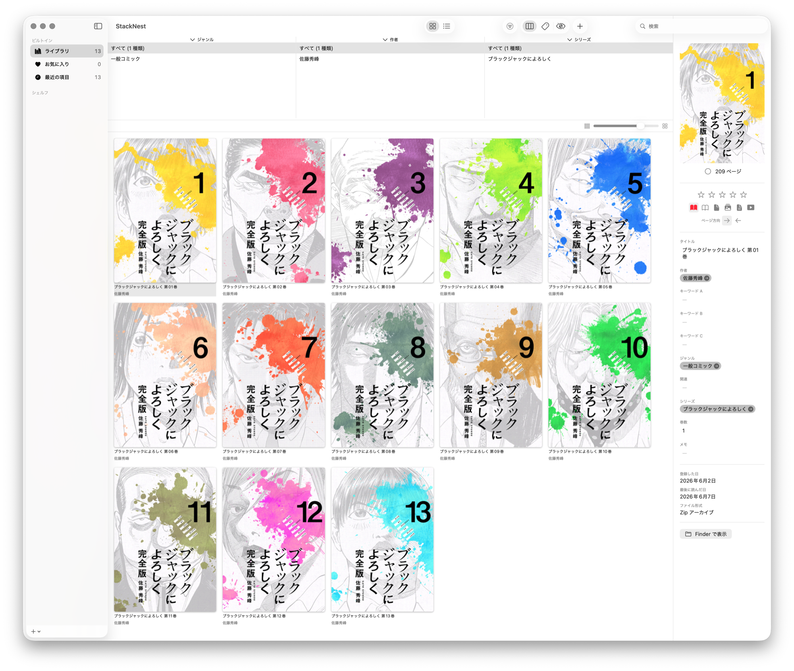

[日本語](README.md) | [English](README.en.md)

# StackNest

[](https://github.com/shelfsmith/stacknest/actions/workflows/ci.yml)

A Swift-native, Apple Silicon image library (catalog) manager that can **import** the
original [Stackroom](https://aromaticsapp.blogspot.com/p/stackroom.html) library XML.

> ⚠️ **Compatibility note:** StackNest only **imports** Stackroom library XML (a one-way read). StackNest's own library format (`.stacknest`) is independent and is **not interoperable with Stackroom** (you cannot open or write it back in Stackroom). StackNest is also a **catalog**: a `.stacknest` holds metadata and cover thumbnails, while the actual image/book files stay outside the library (StackNest references their paths).

> **Status:** Active development. Everything from local browsing to remote sharing to another Mac or an iPhone browser works (see "Features" below for details). The main pillars:
>
> - **Local management** (through Phase 2.9): browse / edit / search, built-in viewer, multi-library, lock, duplicate detection, label customization, DB preventive safety & repair.
> - **Remote sharing / viewing / editing** (Phase 4): a sharing server with a web browser / web reader, a native client from another Mac, offline download, and a persistent on-disk cache for remote viewing.
> - **Permission separation**: **share tokens** split read / edit / admin permission and which libraries are visible per recipient. An edit token can edit metadata / stamps / covers remotely; an admin token can also add / delete remotely.
> - **Automation**: watch-folder auto-import, and local access (CLI `stacknest-cli` / MCP `mcp-stacknest` / OpenAPI + Redoc).



## What is this

StackNest reads the Apple Property List XML library files written by
**Stackroom 2.1b** by aroma / aromatics soft, and provides a modern macOS
native experience for browsing and managing very large image collections
(tested at 10,000+ items).

This project is **not affiliated with aroma / aromatics soft**. It is an
independent implementation written from scratch in Swift that can import
Stackroom library XML (see the compatibility note above for interoperability).

## Why this exists

The original Stackroom (last release: 2.1b Build 198, 2019) is an x86_64-only
binary without arm64 native support. While it continues to work via Rosetta 2,
the long-term path requires a native rewrite.

aroma 氏 (the original author) stated the following around 2019 on a thread on the 5ch 新・Mac 板 (Mac board) ([egg.5ch.net/test/read.cgi/mac/1391446507](https://egg.5ch.net/test/read.cgi/mac/1391446507/)):

> ライブラリファイルはただの XML だし、その気があるなら **たぶん Swift で
> 一から作ったほうが早いくらい** だと思います。

(Translation: "The library file is just XML, so if you're motivated, **probably
the fastest way is just to write it from scratch in Swift**.")

This project follows that explicit recommendation. The original Stackroom
binary, source code, icons, UI screenshots, and Sparkle-style branding assets
are **not** redistributed here. Only the on-disk library format is
re-implemented from observation.

- aroma's original Stackroom: <https://aromaticsapp.blogspot.com/p/stackroom.html>
- aroma's release blog: <https://aromaticsapp.blogspot.com/>

## Features

- **Library browsing**: grid / list views, Browser pane (per-attribute column filtering), Detail pane (metadata editing)
- **Search**: toolbar search bar backed by SQLite FTS5 full-text search (the list auto-scrolls back to the top when you filter after scrolling far down)
- **Multi-value fields**: genre / author / keyword A / B / C are stored as comma-separated values and can be filtered by each individual value in the Browser pane
- **Smart shelves**: dynamic collections from rule lists (N conditions × AND/OR × 4 match types), with an Apple Mail–style condition editor; imported Stackroom smart playlists are evaluated dynamically too
- **Stamp pane**: user-defined chips (5 columns: clear / value / new-add) for batch-applying attributes to multiple books
- **Duplicate detection**: finds same-content books in different directories by SHA-256 byte equality (plus series + volume match). A resolution sheet offers "remove entry only" / "also move file to Trash" and per-group ignore
- **File damage check**: inspects whether your book archives are still intact. Two levels — a quick check (exists / size / opens) and a full CRC check — with **books that were fine last time but are damaged now listed first**. Interruptible at any time, keeping the results so far. **Works over a remote connection** (admin token required) and from the CLI / MCP
- **Label customization**: content fields (genre / neta / keyword A / B / C) and the 6 bookType labels can be renamed per-library, reflected consistently across all surfaces (column headers / sort / Detail / stamps / filters / smart shelves)
- **Viewer key rebinding**: Settings ▸ Keys lets you remap every built-in viewer action to any key (conflicts are rejected; per-row / global reset; the help table reflects the current bindings)
- **Large-library performance**: sorting is optimized for thousands–tens of thousands of items (precomputed ICU collation keys speed up the re-sort that runs on every list refresh)
- **Built-in viewer**: dedicated window / full-screen viewing with a unified pipeline for zip / cbz / cbr / 7z, folders, single images, and PDF. Fit-to-window, pinch / ± zoom, drag panning, zone-click / arrow / Space paging, and digit-key position jumps. **Two-page spread** (per-book override), per-book page direction (right-to-left / left-to-right), slideshow, resume reading, end-of-book behavior (stop / next volume / loop), previous/next-volume nav, an open-in-full-screen setting, fully remappable keys (Settings ▸ Keys), and more. **Instance management** prevents duplicate windows for the same book (opt into a separate window per book via the "Allow multiple viewer windows" setting). Built-in vs. external viewer is switchable in settings. **Page rendering is tuned per CPU architecture** (full-resolution lazy decoding on Apple Silicon, background downscaling on Intel), and archives are read forward in a single pass, so books with many pages turn without stalling
- **Cover editing**: set a book's cover by **selecting any page inside the archive** and **cropping the visible region**, or by **dropping an external image file onto the detail-pane cover** (or the "Set External Image as Cover…" menu → crop). This changes **only the thumbnail (appearance); the archive and the original files are never modified**. Works both locally and remotely (with an editing token), and **when a cover changes on the server, remote clients pick it up on list reload / reconnect** (server-tracking cover cache). **Covers can also be regenerated one book at a time**, and relinking a missing file refreshes the cover and page count automatically
- **File operations**: add / remove from library / ⌫ remove / ⌘⌫ trash / ⇧⌘R rename / ⌘D file move, each with confirmation dialogs
- **Keyboard navigation**: grid / list arrows, Shift+arrows (range select), ⌘↑↓, Home/End, PageUp/Down, Enter to open
- **Grid item size**: per-library persisted slider
- **Library lock**: per-library SHA-256 (salted) password lock. Touch ID / Apple Watch biometric unlock supported
- **Supported formats**: archives ZIP / CBZ / RAR / CBR / 7z (via libarchive), PDF (PDFKit), and EPUB (cover and metadata via [Washi](https://github.com/shunnag/Washi); reading is planned); images JPEG / PNG / GIF / WebP / HEIC / HEIF / TIFF / AVIF (via NSImage)
- **First-run wizard**: on first launch, a paged wizard walks through "image-opening method (built-in / external viewer) → (if built-in) viewer initial settings → first library (create / open / import)". Re-showable anytime from Settings ▸ General
- **Import**: migrate an existing Stackroom library XML into the SQLite database
- **Watch folders (auto-import)**: watch folders and **auto-import** archives / image folders dropped into them (per-folder naming presets, first-run preview, import summary banner). Auto-classification (bookType) and thickness threshold can be **overridden per library** ("follow the StackNest default" / custom). Subfolders are handled per watch folder with **three modes** (ignore / one book per subfolder / recurse into them)
- **Remote sharing (server)**: serve a library over HTTP. **Share tokens** let you issue per-recipient tokens that split **read / edit / admin** permission and the **scope (which libraries are visible)**, with a **per-token QR / URL**, NIC selection / IPv6, downscaled delivery, and locked-library unlock. Creating / renaming / regenerating / revoking a token takes effect **without restarting the server**. Browse from a **web browser** (list / grid, FTS search, sort, paging) and read with the **web reader** (prefetch, spread / single-page, resume, two-way instant page-direction sync, end-of-volume nav, PWA icons). The reader supports **drag-to-turn** (the page tracks your finger 1:1 and settles with momentum) and **spatial navigation** (going back to the list keeps your scroll position and filters)
- **Native remote client**: connect from StackNest on another Mac to a sharing server to browse and edit. Full browse (sidebar / facets / filters / grid / list / detail pane), the built-in viewer, and server-synced reading progress are supported. **With an RW (editable) token the detail pane supports editing** — batch metadata edits, stamps, cover editing, reading-direction changes, and label customization, all remotely (an admin token can also delete books; even an R token can edit rating / unread as shared evaluation / viewing state). **Undo / redo (⌘Z / ⌘⇧Z)** is supported too: undoing a metadata edit restores the server's pre-edit value without clobbering concurrent edits, and undoing a trash delete restores the file to its original location, not just the catalog entry. Deleting several books remotely shows a **progress bar and can be cancelled partway**
- **Persistent on-disk cache for remote viewing**: cache remote pages / covers to disk (LRU + visible-protection + TTL) so **the cache survives reconnect / restart** (manage size / retention / usage / clear under Settings ▸ "Remote cache"). Also includes built-in-viewer prefetch (forward-priority + skip stride, plus a whole-book prefetch toggle), a cached-range band on the progress bar, and following server-side cover changes on list reload / reconnect
- **Offline download**: download selected remote books to local storage and browse / read them **without a connection** (resume supported). Open from the title screen / File menu "Offline". **Multi-select for batch download / delete**
- **Remote / offline volume navigation**: the built-in viewer's previous / next volume works for remote (adjacent volume streamed, even if not downloaded) and offline (consecutive downloaded volumes). For a half-read volume, choose "continue / from start"
- **Local access (CLI / MCP automation)**: the bundled **`stacknest-cli`** drives libraries from the command line (list / add / remove / metadata edit / shelf CRUD / watch / lock / import / relink / dedup / share tokens / stamps / labels). An **MCP server (mcp-stacknest)** exposes the same to **AI agents**. The local endpoint ships **OpenAPI 3.1 + Redoc** API docs

## Requirements

- macOS 14 Sonoma or later (macOS 26 Tahoe is the primary target)
- Apple Silicon native (Universal Binary also produced for x86_64)
- Xcode 26+ to build from source

## Installation (release builds)

Releases are distributed as **self-signed Universal builds produced by CI** (a stable, anonymous self-signed identity; not Apple-notarized). Download `StackNest.app` (zip) from [Releases](https://github.com/shelfsmith/stacknest/releases) and move it to `/Applications` (or anywhere). Because the identity is stable, **permissions you grant the app (e.g. Full Disk Access) persist across app updates**.

Because self-signed apps are blocked by Gatekeeper, a one-time approval is needed (subsequent launches are normal double-clicks).

> **Important (macOS 15 Sequoia and later):** macOS 15 **removed** the "right-click → Open" Gatekeeper bypass. Unsigned / self-signed apps must be **explicitly allowed from System Settings** after being blocked once.

**Option A (recommended, GUI; verified on macOS 15 / 26)**
1. Put `StackNest.app` in `/Applications` and double-click it (a "cannot be opened" dialog appears — click Done).
2. Open **System Settings → Privacy & Security**, scroll to the "Security" section, and click **"Open Anyway"** next to the "StackNest was blocked…" message.
3. Authenticate (Touch ID or your login password) when prompted, then click **"Open Anyway"** again in the confirmation dialog.

**Option B (Terminal)** — remove the quarantine attribute, then launch (no System Settings step needed):
```bash
xattr -dr com.apple.quarantine /Applications/StackNest.app
```

> On macOS 14 and earlier, "right-click → Open" still works; on macOS 15 and later use Option A (allow from System Settings) or Option B.

> ⚠️ Self-signing does not vouch for a verified developer (the certificate is anonymous). Install only from a source you trust (this repo's Releases). This project is not Apple-notarized and notarization is not planned (self-signing is the chosen distribution method). To build it yourself, see "Build" below.

## Repository structure

```
App/                  -- macOS App target (generated by xcodegen; xcodeproj is gitignored)
Sources/
  StackroomFormat/    -- Stackroom library XML/plist reader (for import)
  LibraryStore/       -- SQLite (GRDB) repository, migrations, FTS5, multi-value normalization
  ImageCache/         -- Thumbnail rendering / caching
  ArchiveAdapter/     -- ZIP / CBZ / RAR / CBR / 7z reading via libarchive
  EPUBAdapter/        -- Contract (protocol) for reading EPUBs. Zero dependencies; AppCore depends only on this
  WashiEPUBAdapter/   -- Implementation of that contract on shunnag/Washi (MIT). The only target that imports WashiCore; swappable
  AppCore/            -- App-level logic (LibrarySettings, AppPreferences, LibraryLock, error types, external viewer launch) — SwiftUI-independent for testability
  LibraryServer/      -- Sharing server (Hummingbird), web UI / reader, OpenAPI/Redoc, access tiers / grants
  LibraryServerAPI/   -- DTOs shared by server & client
  RemoteClient/       -- Native remote client (HTTP client, L1/L2 cache, prefetch)
  StackroomImportCLI/ -- Importer executable (swift run stackroom-import)
  StackNestCLI/       -- Headless CLI (stacknest-cli, local / remote operations)
mcp-stacknest/        -- MCP server (Python; wraps stacknest-cli for AI agents)
Tests/                -- Swift Testing modules (swift-testing)
docs/                 -- Architecture, design notes, smoke checklists
```

## Build

### First-time setup: fetch the libarchive headers

```bash
./Scripts/fetch-libarchive-headers.sh
```

The macOS SDK ships the libarchive **library** but **not `archive.h`**, so compilation needs
headers from elsewhere. This script fetches headers of the **same version** as the Apple
libarchive that is actually linked at runtime and places them in
`Sources/ArchiveAdapter/Carchive/vendor/` (gitignored — not part of the repository).

The build also works without it as long as Homebrew's libarchive is installed, but then the
**header and runtime versions drift**. Drift can silently change behaviour in APIs that exist in
both versions with different return values, so `LibarchiveVersionTests` in `swift test` fails to
tell you about it.

That test's verdict is baked in at compile time, so a stale verdict can survive if you edit
`vendor/` by hand (going through the script resolves it automatically). If the result makes no
sense, rebuild with `swift package clean`.

### SPM library and CLI

```bash
swift build
swift test
swift run stackroom-import --xml "$HOME/Library/Application Support/stackroom/Stackroom Library.xml" --out /tmp/stackroom.sqlite --force
```

### macOS App

The `xcodeproj` is gitignored, so generate it first with `xcodegen`:

```bash
cd App && xcodegen && cd ..
xcodebuild \
  -project App/StackNest.xcodeproj \
  -scheme StackNest \
  -configuration Debug \
  -destination 'platform=macOS' \
  build
```

Universal Binary (arm64 + x86_64) release build:

```bash
xcodebuild \
  -project App/StackNest.xcodeproj \
  -scheme StackNest \
  -configuration Release \
  -derivedDataPath build \
  CODE_SIGN_IDENTITY=- CODE_SIGNING_REQUIRED=NO CODE_SIGNING_ALLOWED=NO \
  ARCHS="arm64 x86_64" ONLY_ACTIVE_ARCH=NO \
  build
```

Or open `App/StackNest.xcodeproj` in Xcode after running `xcodegen`.

See `docs/importer.md` for the CLI Importer reference.

## Using StackNest

After building the app or running `xcodebuild`, launch the macOS app:

```bash
open ~/Library/Developer/Xcode/DerivedData/StackNest-*/Build/Products/Debug/StackNest.app
```

On the very first launch (fresh install, no settings), a first-run wizard guides you through the image-opening method and your first library. On subsequent launches (or when no library is selected) the app shows a title screen with three actions:

- **Create a new library**: pick a location and create an empty `.stacknest` bundle
- **Open an existing library**: pick an existing `.stacknest` bundle
- **Import from a Stackroom Library**: read aroma 氏's original Stackroom XML (`Stackroom Library.xml`) and save it as a new `.stacknest` bundle

### Multi-library support

Each `.stacknest` bundle is an independent library (a macOS bundle containing a SQLite DB and asset directories), and each library opens in its own window. Multiple libraries can be open at once; trying to open the same library twice brings the existing window to the front (`OpenLibraryRegistry` prevents duplicate opens).

The startup mode can be changed in app preferences (`⌘,`) under "Startup":

- **Show title screen** (default)
- **Open last-opened libraries**: reopen every library that was open at quit time
- **Open a specific library every time**: always open one designated library on launch

### Configuring the external viewer

By default, books open in the **built-in viewer**; switch built-in / external in **Settings ▸ 表示 (Display) ▸ 画像ビューワ (Image Viewer) ▸ ビューワ (Viewer)**. To use an external viewer, configure it in **Settings** (`⌘,`). Click "Choose…" and pick an image-viewer app (cooViewer, Avian, Preview, etc.). Without this, the system's Archive Utility would just extract `.zip` files instead of viewing them. The selected viewer is persisted across launches via `UserDefaults`.

Once configured, double-clicking a book in the grid opens the file (or its cover image) directly in the chosen viewer.

### Importing from the command line

The same database that "Import from a Stackroom Library" produces can also be created from the command line with `swift run stackroom-import` (see `docs/importer.md`). Place the resulting SQLite DB inside a `.stacknest` bundle and then use "Open an existing library" to open it.

### Remote access (sharing / client / offline)

The same StackNest acts as both a **server (sharing)** and a **client**. You can browse your library from another Mac, an iPhone, or a tablet browser.

**On the server side (share)**
1. Open the library you want to share and turn **sharing ON** via the **antenna (delivery indicator)** in the toolbar (or the sharing settings).
2. In server settings, create **share tokens** that split **permission (read / edit / admin)** and **scope (which libraries are visible)** per recipient, and hand the token's **URL / QR code / token** to the connecting side (NIC selection and IPv6 supported). Creating / renaming / regenerating / revoking a token takes effect **without restarting the server**. Locked libraries require a password unlock on the connecting side.
3. **Security:** do not expose the port directly to the internet; prefer access over a VPN such as **Tailscale** (LAN use is the assumption).

**From a web browser**
- Open the share URL on the connecting side to browse with list / grid, full-text search, sort, and paging; open a book to read in the web reader (prefetch, spread / single-page, resume, page-direction sync).

**Native client (from StackNest on another Mac)**
- Use **"Connect to a server…"** from the title screen (or File menu), enter the URL and token. You get full browse (sidebar / facets / filters / detail pane) and the built-in viewer; reading progress is synced back to the server. **When you connect with an RW (editable) token, you can edit metadata (single / multi-select), stamps, cover (archive page selection / crop / setting an external image as the cover via drag & drop or the "Set External Image as Cover…" menu), and reading direction remotely** (an R token is read-only). Covers change **appearance only**; the archive itself is never modified. If a cover changes on the sharing host or another client, this client follows it on list reload / reconnect.

**Offline (read without a connection)**
- While connected, **right-click a book → "Download"** to store it locally. **Multi-select mode → batch download** is also available (narrow to a series via facets / search, then "Select all").
- From the title screen / File menu **"Offline (downloaded)"**, browse and read downloaded books **even without a server connection** (resume and volume navigation supported). Remove unneeded books via multi-select mode.

### Local access (automation via CLI / MCP)

StackNest can drive libraries from the **command line or AI agents** without the GUI.

- **Enable:** turn it on under **"General ▸ Local access"** in app settings (`⌘,`) — a `127.0.0.1`-only local-control endpoint.
- **CLI:** the bundled **`stacknest-cli`** covers list / add / remove / metadata edit / shelf CRUD / watch config / lock / import / relink / dedup scan / share-token management / stamps / labels / **file damage check** (`integrity scan / status / list / full-scan / job-status / cancel`) (`stacknest-cli --help`). Passwords are read from stdin so they never appear in argv.
- **MCP:** register **`mcp-stacknest`** (a Model Context Protocol server) to get the same operations from a compatible AI agent. See `mcp-stacknest/README.md`.
- **API docs:** the local endpoint is API-only; opening the root (`/`) in a browser shows the **Redoc (OpenAPI 3.1)** API reference.

## File damage check (Phase G27+)

Inspects whether your book archives are still intact. File ▸ **ファイルの破損チェック…** opens a dedicated window. It is an independent window, so a running scan blocks neither other work nor quitting the app.

| Mode | Scope |
|---|---|
| Scan unchecked | books not yet inspected |
| Rescan everything | all books (**hours to tens of hours** on a large library, so it confirms first) |
| Recheck damaged only | books previously judged damaged (e.g. after replacing a file) |

Two levels. The **quick check** looks at whether the file exists, its size, and whether it opens. The **full (CRC) check** reads every entry inside the archive and verifies it — conclusive, but slow. **It can be interrupted at any time, and results so far are kept.**

**Books that were fine last time but are damaged now are listed first**, so the ones worth restoring from backup are easy to find.

Covers `.zip` / `.cbz` / `.rar` / `.cbr` / `.7z` and single images. Folders, videos and PDF / EPUB carry no CRC and are recorded as out of scope — which does not mean they are intact.

**It works over a remote connection too.** Because the job can run for many hours, **starting one requires an admin token**: the menu item is enabled only when the library is unlocked and the connection is admin. "Reveal in Finder" is unavailable remotely, since the paths belong to the server machine.

From the CLI: `stacknest-cli integrity scan / status / list / full-scan / job-status / cancel`.

> **Not the same as "データベースを検査" in library settings.** That one inspects the library's own SQLite database; this one inspects the contents of your book files.

## Library lock (Phase 2.5b+)

Each `.stacknest` library can be password-protected. Touch ID / Apple Watch biometric unlock is supported.

**When a lock already exists, both changing and removing it require the current password** (setting one where none exists does not). Leaving a library unlocked and unattended no longer lets a third party overwrite the password and take it over. The rule applies to the GUI, HTTP and CLI alike.

### Forgotten password

There is no recovery mechanism. The lock is intended as a casual barrier against incidental access, not encryption. If you forget the password, you can **unlock the library by editing the DB directly**:

```bash
sqlite3 /path/to/MyLibrary.stacknest/library.sqlite \
  "DELETE FROM library_settings WHERE key IN ('lock_password_hash', 'lock_password_salt', 'lock_use_biometric');"
```

After running this command, the library is unlocked and can be opened in StackNest again. You may re-configure the lock from File menu ▸ This Library's Settings… (⇧⌘,).

Notes:
- The lock only protects the plaintext password via SHA-256 with salt. The library DB and image files themselves are not encrypted.
- For truly sensitive data, use another mechanism such as Disk encryption or FileVault.

## Roadmap

Development proceeds in incremental phases. Summary:

| Phase | Scope | Status |
|---|---|---|
| 2.1 | Stackroom XML importer (CLI + SQLite/GRDB) | ✅ Done |
| 2.2 | Grid / icon view, thumbnails, archive reading | ✅ Done |
| 2.3 | Sidebar (library / favorites / recent), shelves, detail pane | ✅ Done |
| 2.4 | List view, toolbar / facet filters, FTS5 search, editing | ✅ Done |
| 2.5 | Multi-library, file CRUD, cover editing, undo, lock, naming, auto-classify, PDF import | ✅ Done |
| 2.5k | Grid / list keyboard navigation | ✅ Done |
| **2.6a** | **Smart shelves MVP** (rule-based collections) | ✅ Done |
| **2.6b** | **Built-in viewer core MVP** (full-screen, fit / zoom / pan, paging; PDF / archive / folder / single image) | ✅ Done |
| **2.6b-2** | **Built-in viewer extensions** (two-page spread, per-book page direction, slideshow auto-advance, resume reading, end-of-book next / loop, open-in-full-screen, HEIC / HEIF / TIFF / AVIF support) | ✅ Done |
| **2.6c** | **First-run wizard** (built-in vs external viewer choice, built-in viewer initial settings, first library creation, re-show from Settings) | ✅ Done |
| 2.7 | Polish & performance (duplicate detection, field / bookType label customization, sort optimization, viewer key-rebinding UI, multiple naming-format presets) | ✅ Done |
| **2.8** | **Library safety** (relink missing files, DB auto-backup + integrity check, NFC normalization fix) | ✅ Done |
| **2.9** | **DB repair** (in-app `.recover` to salvage data from a corrupt DB, with recovered-count prompt) | ✅ Done |
| 4.0+ | Server / client (sharing server, web browser / reader, native client, offline download, **share tokens** [read / edit / admin × scope], **remote editing** [metadata / stamps / cover: page selection, crop, **external image as cover** / remote add & delete / **undo & redo** (⌘Z / ⌘⇧Z)], **persistent on-disk cache for remote viewing + prefetch + server-tracking cover cache**, screen-size-aware image delivery, **watch-folder auto-import** (now under the Import tab), **built-in viewer instance management** (prevents duplicate windows; "Allow multiple viewer windows" setting), **undo fidelity** (never clobbers concurrent edits; trash-delete undo also restores the file), list auto-scrolls to top when filtering, **security hardening** (closed an arbitrary-file-move path via remote restore), **local access (CLI `stacknest-cli` / MCP `mcp-stacknest` / OpenAPI + Redoc)** — remote parity implementation complete as of the v0.12.0 RC; rc.3 adds **rendering performance** [per-architecture rendering, single-pass archive reads, web reader drag-to-turn / spatial nav] and **security hardening**) | ✅ Done |
| 4.5 | **Two-way Finder tag sync** (one field per library, three-way merge so deletions carry across, Spotlight keeps the cost independent of library size, tag colours preserved), **a loupe in the built-in viewer** (scroll to change magnification, choose shape and size, magnified area re-decoded so it stays sharp) — v0.13.0 | ✅ Done |
| 5.0+ | **Headless / Docker support** (run the sharing server without StackNest.app — always-on, containerized distribution, deployment / config hardening) | ⏳ planned |

Legend: ✅ done / 🔄 in progress / ⏳ planned / 🔭 future

> Phase 3 (the stable-release ceremony) was dismantled as it did not fit this project's direction; its completed items (icon / branding, etc.) were absorbed into earlier phases.

See [CHANGELOG.en.md](CHANGELOG.en.md) ([日本語](CHANGELOG.md)) for per-release changes.

## Feedback & community

Questions, requests, bug reports, and show-and-tell are welcome in [GitHub Discussions](https://github.com/shelfsmith/stacknest/discussions) (use **Q&A** for questions, **Ideas** for requests). Bugs with reproduction steps can also go to [Issues](https://github.com/shelfsmith/stacknest/issues).

## License

MIT — see `LICENSE`.

## Acknowledgements

- aroma 氏 / aromatics soft for the original Stackroom and the explicit
  encouragement to rewrite it in Swift.
